# Laporan Jobsheet 6

---

## 1) layout_flutter

# Praktikum 1
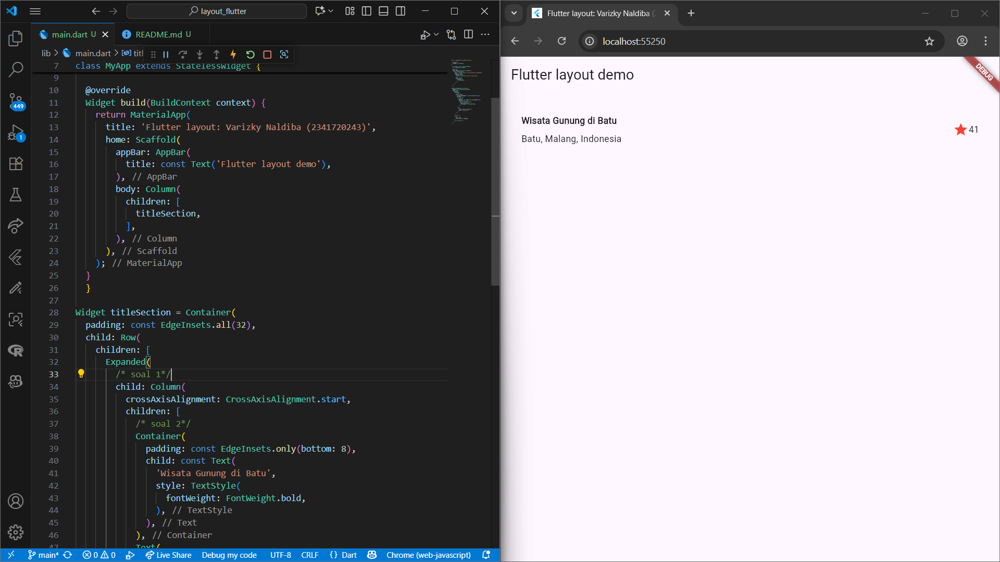

# Praktikum 2
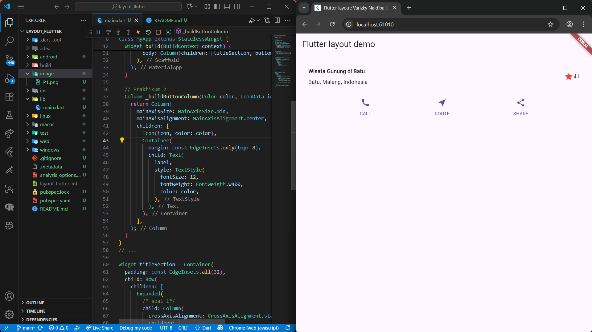

# Praktikum 3
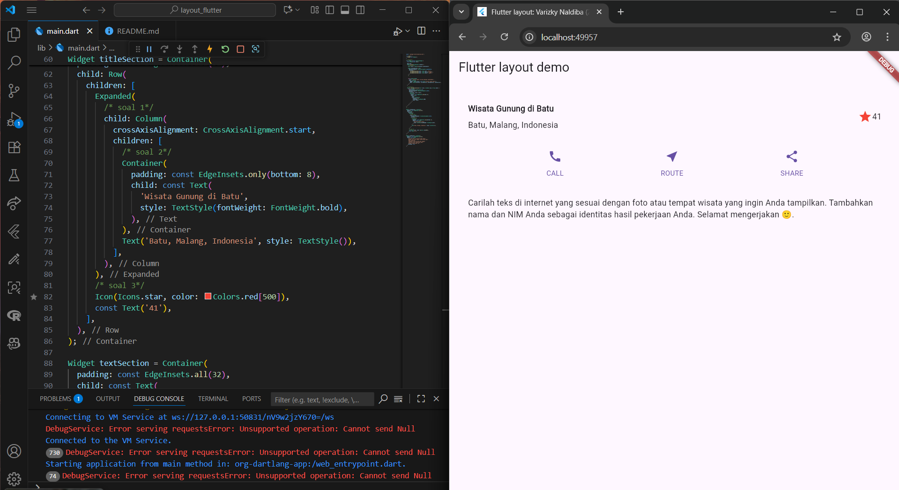

# Praktikum 4
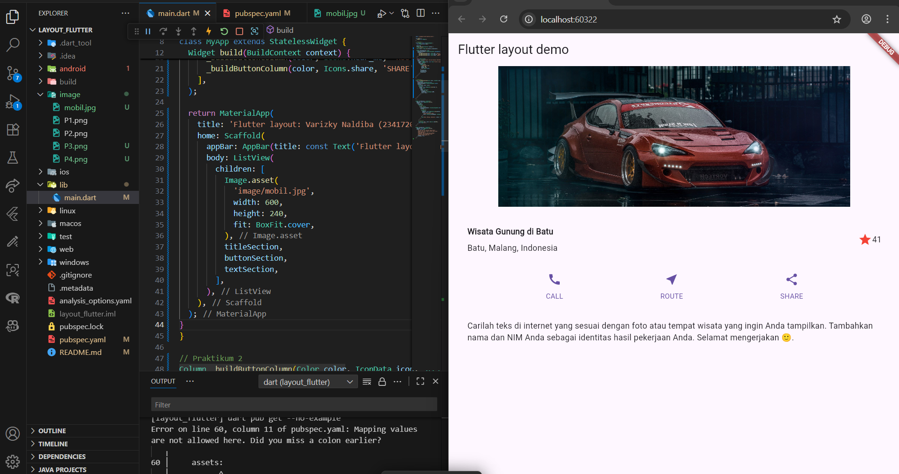

---

## 2) basic_layout_flutter

# Tugas Praktikum 1
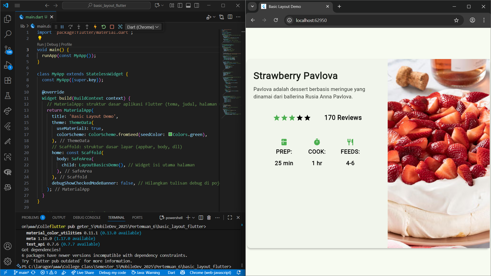

---

## 3) belanja

# Praktikum 5
## Implementasi route dan navigasi
### dari home
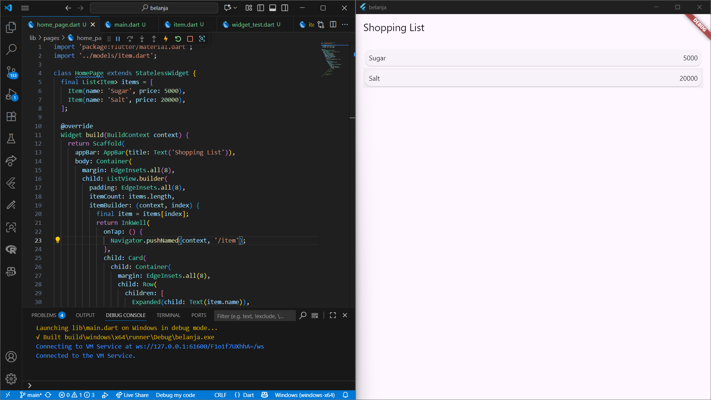
### ke item after klik
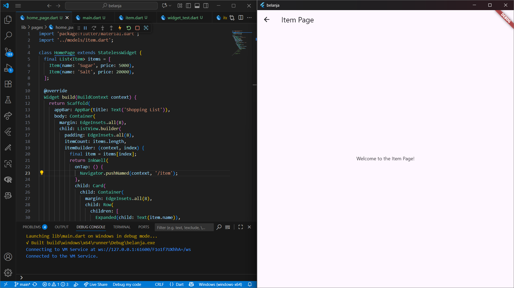

# Tugas Praktikum
## Hasil dari pengimplementasian modal route
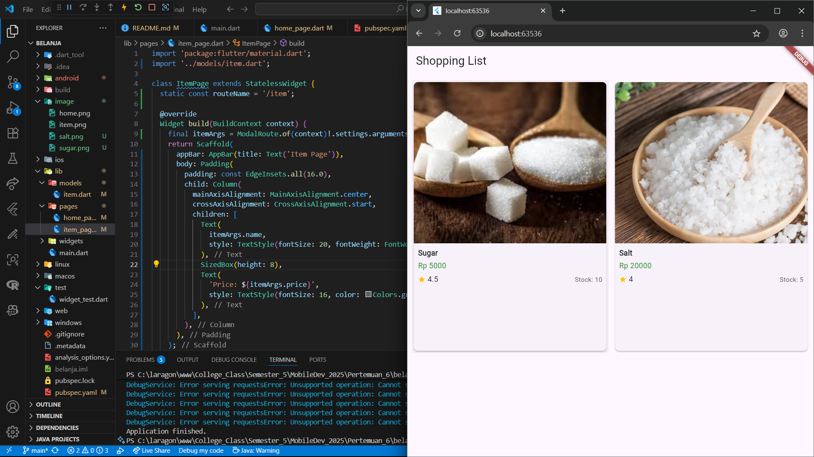
### after klik
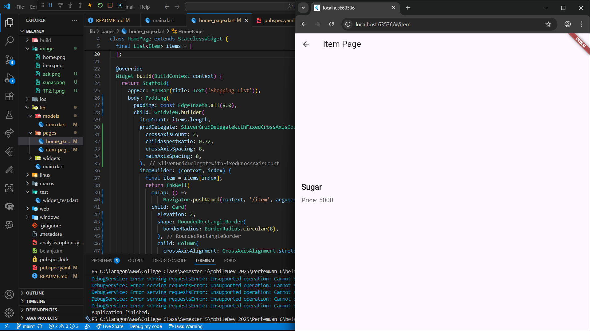

## Hasil pengimplementasain hero widget
### setelah di klik
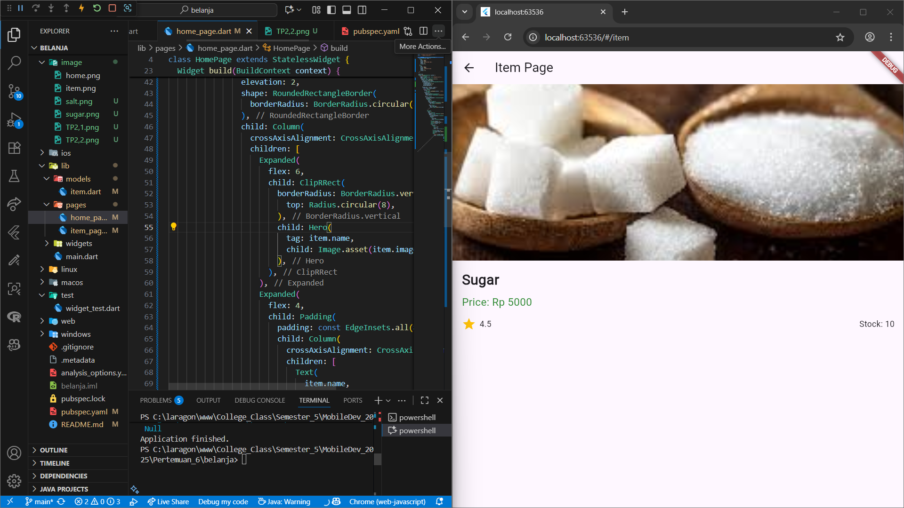

## Pemecahan widget menjadi beberapa bagian, jadi tidak berkumpul di 1 file
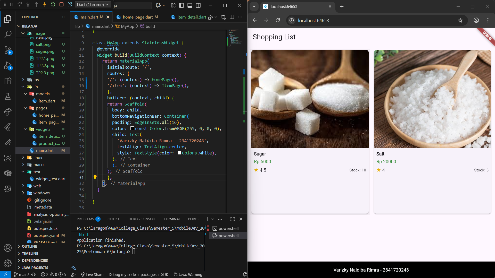

## implementasi go_route
- flutter pub add go_router

- update navigasi (context.pushNamed / context.goNamed). di file home_page.dart
- tambahkan navigasi dari home ke item dart dengan
  Navigator.pushNamed(context, '/item', arguments: item);
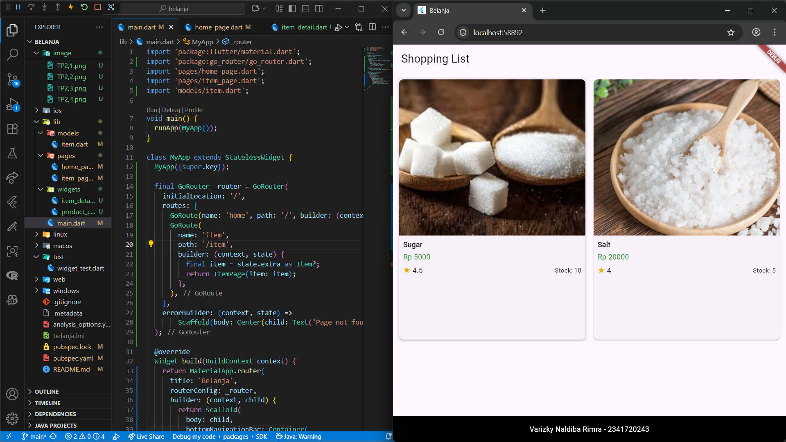

---

Catatan:
- Saya menyesuaikan path gambar agar relatif terhadap lokasi file gabungan (`README_combined.md`). Jika Anda ingin menimpa salah satu README asli atau menyimpan gabungan di nama/ lokasi lain, beri tahu saya dan saya akan lakukan perubahan.
