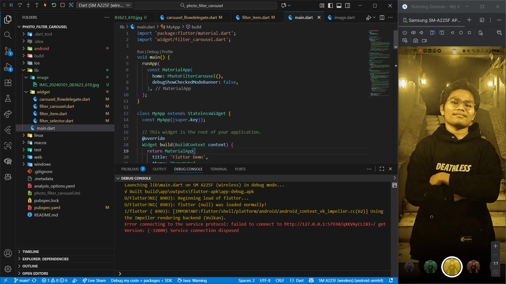
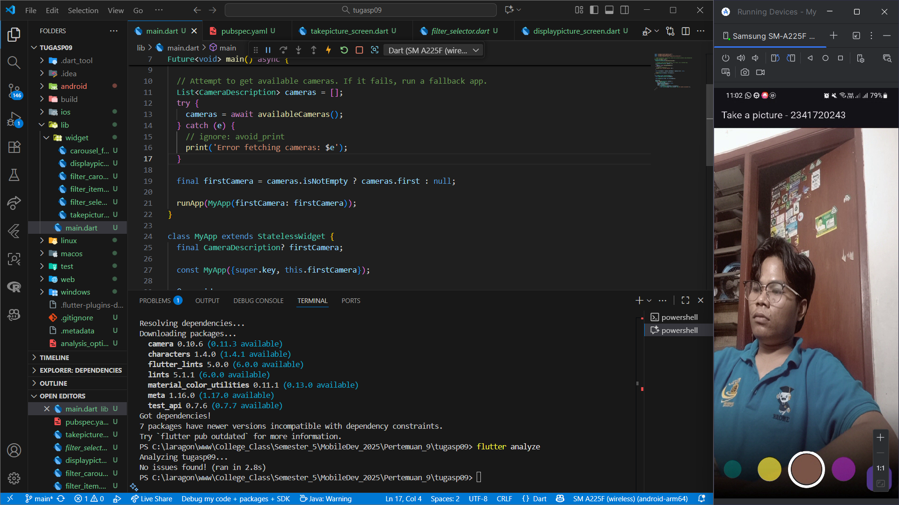

# Praktikum 1
> Pada Praktikum saya menghubungkan kamera pada mobilr dengan flutter. sehingga aplikasi flutter pada mobile dapat mengambil gambar

# Praktikum 2
> Pada Praktikum saya membuat filter yang dapat mengubah warna dari foto yang saya upload

# Tugas Praktikum
> Pada tugas Praktikum saya menggabungkan kamera dengan filter yang telah saya lakukan sebelumnya, jadi saya tidak memasukkan image pada project ini

## Pertanyaan Tugas Praktikum
1. Selesaikan Praktikum 1 dan 2, lalu dokumentasikan dan push ke repository Anda berupa screenshot setiap hasil pekerjaan beserta penjelasannya di file README.md! Jika terdapat error atau kode yang tidak dapat berjalan, silakan Anda perbaiki sesuai tujuan aplikasi dibuat!
2. Gabungkan hasil praktikum 1 dengan hasil praktikum 2 sehingga setelah melakukan pengambilan foto, dapat dibuat filter carouselnya!
3. Jelaskan maksud void async pada praktikum 1?
> avoid async pada main berfungsi untuk menunggu tersedianya kamera dengan syntax "await", tanpa async aplikasi akan error
4. Jelaskan fungsi dari anotasi @immutable dan @override ?
> * immutable menandai bahwa class tersebut tidak boleh diubah setelah dibuat jadi otomatis seluruh properti yang ada pada class harus bersifat final
* override merupakan code implementasi ulang dari method yang sudah ada akan tetapi ingin ada perubahan, jadi tidak perlu membuat function baru jika ada method parents yang mirip mirip.
5. Kumpulkan link commit repository GitHub Anda kepada dosen yang telah disepakati!
https://github.com/VarizkyNaldiba/MobileDev_2025/tree/main/Pertemuan_9